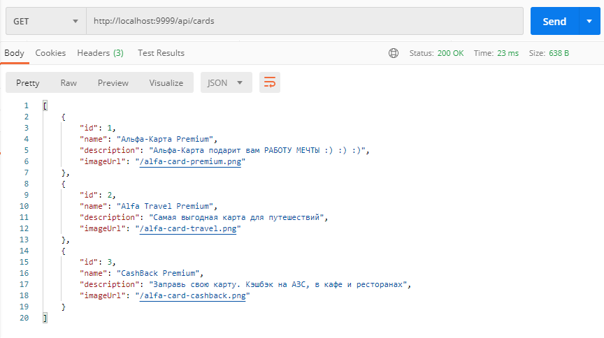

#Домашнее задание к занятию <3.1 Docker>, PostgreSQL: 

###Задача:
необходимо подготовить приложение к тестированию на СУБД PostgreSQL.

###Приложение: [db-api.jar](https://github.com/netology-code/aqa-homeworks/raw/aqa4/docker/db-api.jar)

###Процесс:
- запускаем docker-compose командой: ```docker-compose -f docker-compose.yml up -d```
- дожидаемся запуска postgresql
- запускаем приложение командой: ```java -jar db-api.jar```
- проверяем результат путем запроса: ```GET http://localhost:9999/api/cards```

###Результат:
